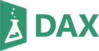

# **Le langage DAX** 

Dax pour Data Analysis Expressions, en français, Expressions pour l'Analyse des Données.  

C'est un langage de formules et d'expressions utilisé principalement dans les outils de modélisation de données et d'analyse de données. DAX permet d'effectuer des calculs et des analyses de données avancées telles que :  

1. Calculs de colonnes et de mesures : créer des calculs personnalisés pour les colonnes et les mesures dans un modèle de données.
   > Pour de créer des expressions pour effectuer des opérations mathématiques, statistiques, logiques et textuelles sur vos données.

2. Agrégation de données : agréger des données en fonction de différents niveaux de granularité.
   > Afin de calculer des totaux, des moyennes, des maxima, des minima, etc., en fonction de vos besoins analytiques.

3. Filtrage et manipulation de données : filtrer et manipuler des données en fonction de critères spécifiques.
   > Permet de créer des expressions pour extraire des sous-ensembles de données qui correspondent à des conditions données.

4. Calculs des indicateurs clés de performance : DAX peut calculer des ratios, des pourcentages, des parts de marché et d'autres indicateurs clés de performance.

5. Calculs de temps : DAX dispose de fonctions pour effectuer des calculs liés à la date et à l'heure. 
   > Essentiel pour l'analyse temporelle, telle que la croissance mensuelle des ventes, les moyennes mobiles, etc.

6. Hiérarchies et relations : prend en charge la gestion des hiérarchies et des relations entre les tables.
   > Crucial pour créer des rapports et des visualisations interactifs.

7. Utilisation dans des tableaux croisés dynamiques et des graphiques : largement utilisé pour créer des tableaux croisés dynamiques, des graphiques et des visualisations dans des outils tels que Power BI et Excel.

8. Analyse des tendances : en calculant des moyennes mobiles, des totaux cumulés, des taux de croissance, et cætera.

___

* Introduction
* Créer une mesure DAX
  > Une mesure DAX à toujours la même structure :  
  > `Nom de la mesure = count(Table[Colonne])`  
  >> Le nom de la mesure démarre la formule _(qui sert d'unité)_ ;  
  >> Une fonction DAX (ici la fonction `count()`) ;  
  >> Entre parenthèses, la table sur laquelle est appliquée la mesure ;  
  >> Puis, entre crochés, la colonne.  
* Créer une mesure rapide
  > La mesure rapide est limité car elle n'utilise pas les fonctions, mais, propose différents types de traitement des données, comme les filtres, les totaux, les opérations mathématiques, etc.  
  > Puis le code DAX est généré  et affichier, et peut-petre modifier au besoin.
* Créer une colonne en DAX
* Créer un tableau en DAX
* Organiser les mesures dans un dossier
* Les fonctions horaires
   * calendrier et date
   * Datediff
   * Day
   * weeknum
   * weekday
   * month
   * year
   * edate
   * now
* Appliquer une fonction sur une colonne
* Les fonctions de filtre
* Les fonctions d'informations
* Les fonctions logiques
* Les fonctions mathématiques
* Les fonctions de texte
* Les fonctions de relation
* Les fonctions statistiques
* Les fonctions de manipulation de tables

___
[TP](8_tpDax)